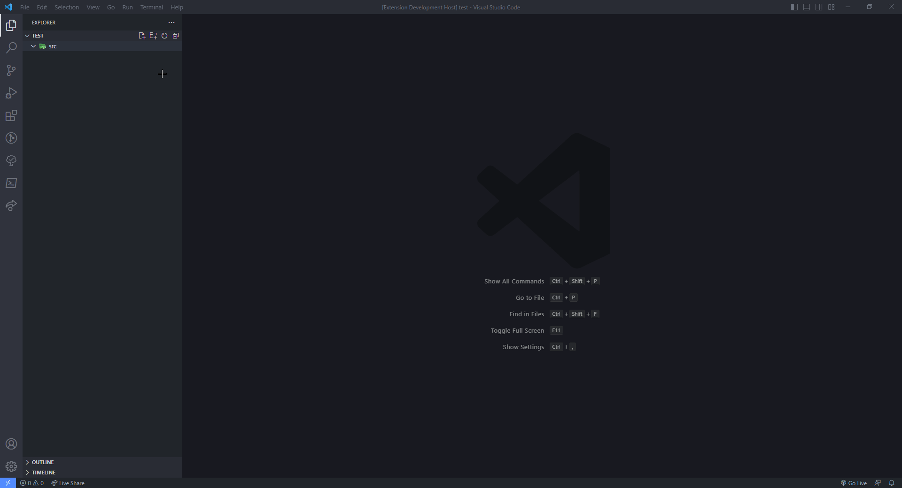

# fivem-resource-creator

## Features

* Automatically creates a FiveM resource with a selected template (Script/NUI/Vehicle)

## Usage

* **Method 1 (Folder Context Menu):**
  * Right click on a folder
  * Click `Create FiveM Resource`
  * Follow the prompts
* **Method 2 (Command Line):**
  * Open command line by pressing `F1` or `Ctrl + Shift + P`
  * Search and select `Create FiveM Resource`
  * Follow the prompts

## Preview

## Requirements

**fs-extra:** `npm install fs-extra`

## Known Issues

No known issues

## Release Notes

### 1.0.0

Initial release of FiveM Resource Creator
